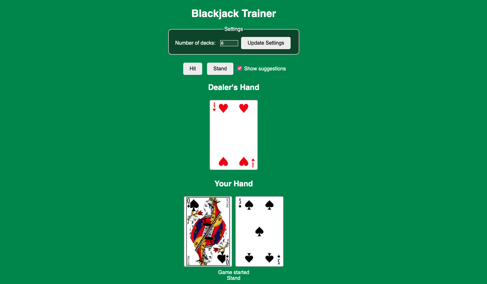

# blackjack-trainer
# Blackjack Trainer

This is a blackjack game that helps users practice basic strategy. Card counting has not been implmented yet. 

### 1. Setup Instructions  

```bash
# clone repo
git clone https://github.com/Grace-Armstrong/blackjack-trainer.git

# navigate to repo and install flask
cd blackjack-strategy-game
pip install -r requirements.txt

# launch the game and open the address listed
python app.py

```
### 2. Enjoy Game Play

The game has the ability to toggle off/on basic strategy suggestions. 